<h1 align="center">William Soares Costa</h1>

  

  
  

---

### Sobre mim

Comecei em campo, instalando câmeras e interfones com meu pai. Passei pelo SENAI, service desk,
suporte e infraestrutura até chegar em DevOps. Hoje cuido de plataformas em **AWS** e **Azure** com
**Terraform**, **Kubernetes** e **GitOps**, e o que mais gosto é tirar trabalho manual do caminho
dos times sem abrir mão da segurança.

- 🔭 Agora: GitOps com **Argo CD no EKS**, tudo criado por Terraform
- 🔐 Obsessão do momento: pipeline que entra na AWS **sem nenhuma chave guardada** (OIDC)
- 🎓 Pós em Cloud, AI e DevOps em andamento
- ✍️ Escrevo sobre o que aprendo em [williamsoares.com/blog](https://williamsoares.com/blog)

---

### Uma esteira que eu montei

  

Commit na develop → testes → scan → imagem no ECR → Argo CD aplica no EKS. Sem <code>kubectl apply</code> e sem senha no pipeline.

---

### No dia a dia

  

  
  
  
  
  
  
  
  
  

---

### Projetos que eu conto com detalhe

| | Projeto | O que mudou |
|---|---|---|
| 🔐 | [Da herança ao deploy sem senha](https://williamsoares.com/projetos#esteira-deploy-sem-senha) | 41 módulos Terraform auditados; site no ar em **1m49s** com login na AWS por OIDC |
| ☸️ | [Backend no EKS com GitOps](https://williamsoares.com/projetos#backend-gitops-argocd) | Argo CD por Terraform; o pipeline não toca no cluster, só no Git |
| 🐳 | [Imagem Docker de 26 vulnerabilidades para zero](https://williamsoares.com/projetos#imagem-docker-segura) | Multi-stage, npm fora da imagem final e Trivy barrando HIGH/CRITICAL |
| 🔑 | [Quando o GitHub mudou o login na AWS](https://williamsoares.com/projetos#oidc-ids-imutaveis) | AccessDenied diagnosticado pelo CloudTrail; IDs imutáveis no token |
| ♻️ | [Um pipeline para vários repositórios](https://williamsoares.com/projetos#workflows-reutilizaveis) | Workflows reutilizáveis e versionados, sem YAML copiado |

Todos com código real, prints e o passo a passo em <a href="https://williamsoares.com/projetos">williamsoares.com/projetos</a>.

<b>Outras coisas com que já trabalhei</b>

 

**AWS:** VPN com Transit Gateway em Terraform · Security Hub · redução de custo com Cost Explorer e desligamento de recursos ociosos · EKS com Prometheus e Grafana

**Azure:** Terraform e ARM Templates com CI/CD · AKS · grupos dinâmicos e tags no Entra ID · migração do AD local para o Entra ID · endpoints com Intune · Azure Cost Management

**Infra:** Ansible · backup e recuperação com Veeam · firewalls e VPNs Fortigate · redes Wi-Fi Cisco e Fortinet

---

### Últimos artigos

- [GitOps do zero no EKS: nenhum kubectl apply](https://williamsoares.com/blog/gitops-do-zero-no-eks)
- [O dia em que o OIDC quebrou sozinho](https://williamsoares.com/blog/oidc-quebrou-ids-imutaveis)
- [26 vulnerabilidades e nenhuma era do meu código](https://williamsoares.com/blog/imagem-docker-26-vulnerabilidades)
- [Herdei 41 módulos Terraform. Antes de criar, auditei](https://williamsoares.com/blog/auditoria-41-modulos-terraform)

---

  

Feito com código, cloud e café ☕

